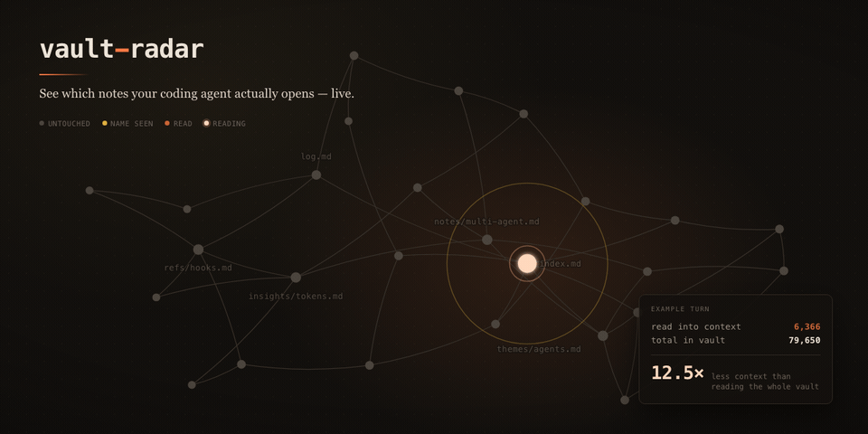

# vault-radar

*English version: [README.md](README.md)*

**Kodlama ajanının gerçekte hangi dosyaları okuduğunu canlı olarak izle.**

Claude Code'a bir soru soruyorsun. Cevap veriyor. Peki 74 notunun hangilerini
açtı — ve hangi 69'una hiç dokunmadı? `vault-radar` bunu olup biterken ekrana
getiriyor.



```
❯ multi-agent videomda ne anlatmıştım?

  ▪ index.md                                   1.102   ← read
  ▫ themes/multi-agent.md                      1.188   ← read
  ▫ videos/multi-agent-claude-4-bolduk.md      1.419   ← read
  ▫ insights/token-verimliligi-talebi.md         728   ← read
  ░ log.md                                     1.222   ← grep saw it, never opened
  · 69 more files                                      ← never touched

  6.366 read   /   79.650 total   =   12,5× less
```

## Neden

Ajan hafıza sistemleri hep aynı vaatle satılıyor: ajan her şeyi okumaz, gezinir.
Bu vaat genelde görünmez kalıyor — cevabı görüyorsun, izlediği yolu hiç
görmüyorsun. `vault-radar` o yolu görünür kılıyor; böylece index'in işini mi
yapıyor, yoksa ajan klasörü kaba kuvvetle mi tarıyor, kendin anlayabiliyorsun.

## Kurulum

Python 3.9+ yeterli. Hiçbir bağımlılık yok.

```bash
git clone https://github.com/selmakcby/vault-radar
cd vault-radar
python3 radar.py install        # hook yapılandırmasını yazdırır
```

Yazdırılan bloğu `~/.claude/settings.json` içine ekle (varsa mevcut `hooks`
bloğuyla birleştir), Claude Code'u yeniden başlat ve sonra:

```bash
python3 radar.py serve --vault ~/notes
# http://localhost:7777 adresini aç
```

Tarayıcı penceresini ekranın sağ yarısına park et ve her zamanki gibi çalış.

## Nasıl çalışıyor

Üç parça, sihir yok:

1. **Bir hook.** Claude Code her tool çağrısından sonra `PostToolUse` tetikliyor.
   `radar.py hook` stdin'den gelen payload'ı okuyup `~/.vault-radar/events.jsonl`
   dosyasına tek satırlık bir JSON ekliyor. `Read`, `Grep`, `Glob` ve `Bash` ile birlikte
   `UserPromptSubmit` ve `Stop` olaylarını yakalıyor. Kabuktan `cat`/`head`/`sed` ile
   okunan her dosya sayılır; kabuk `grep`/`rg` eşleşmelerini komutun kendi çıktısından alır.
2. **Bir sunucu.** `radar.py serve` vault'unu bir kez indeksliyor (yol, boyut,
   tahmini token ve notlar arasındaki `[[wikilink]]` ile `[metin](dosya.md)` bağlantıları,
   yani grafın kenarları) ve olay log'unu takip edip her yeni satırı Server-Sent Events
   üzerinden gönderiyor.
3. **Bir görüntüleyici.** Tek bir HTML dosyası. Vault'undaki her dosya bir satır;
   ajan dokundukça satırlar yanıyor ve küçük bir sprite prompt'tan o an okunan
   dosyaya doğru yürüyor.

Hook asla bloklamaz ve asla hata fırlatmaz — bozuk bir payload sessizce yutulur.
Radar sadece izler; senin turunu bozmaya yetkisi yok.

## Durumlar

| | anlamı |
|---|---|
| sönük | bu turda hiç dokunulmadı |
| sarı | bir `grep`/`glob` eşleşti — ajan **adını** gördü, içeriğini değil |
| turuncu | gerçekten açıldı ve context'e okundu |

İlginç olan sarı durum. Kırk dosya adı döndüren bir arama neredeyse bedava; kırk
dosyayı açmak ise her şeye mal oluyor. Radar bu farkı gösteriyor.

## Obsidian'ın kendi graph'ı içinde

Bağımsız görüntüleyici kendi graph'ını çiziyor. Zaten Obsidian'da yaşıyorsan onu
es geçebilirsin: pakete dahil eklenti, ajan çalışırken **Obsidian'ın gerçek graph
view'ını** boyuyor.

```bash
./install-obsidian-plugin.sh ~/path/to/vault
```

Sonra Obsidian'da: **Settings → Community plugins → Restricted mode'u kapat**,
vault'u yeniden yükle, graph'ı aç ve ajanına bir prompt ver.

Eklenti aynı `events.jsonl` dosyasını doğrudan okuyor — Obsidian Electron üzerinde
çalıştığı için Node'un `fs`'i elinin altında. Bunun için **`radar.py serve`'in açık
olması gerekmiyor**; hook tek başına yeterli.

| renk | anlamı |
|---|---|
| soluk şeftali, büyütülmüş | şu anda okunuyor |
| turuncu | bu turda okundu |
| kehribar | bir arama adıyla eşleşti, hiç açılmadı |
| varsayılan | dokunulmadı |

### Robot

Küçük bir sprite graph'ın kendi Pixi container'ına bağlanıyor, yani her şeyle
birlikte kayıyor ve yakınlaşıyor. Ajan bir dosya açtığında robot oraya
**kenarlar üzerinden yürüyor**: eklenti `renderer.links` üzerinde bir
breadth-first search çalıştırıp gerçek rota boyunca düğümden düğüme animasyon
yapıyor. İki dosya birbirine bağlı değilse doğrudan atlıyor — ki bu da kendi
başına bilgi verici: o sayfa, ajanın az önce bulunduğu yerden erişilebilir değil
demek.

Eklenti ayarlarından robotu kapatabilir, boyutunu ya da hızını değiştirebilirsin.

Durum çubuğundaki bir öğe, mevcut turun dosya sayısını ve tahmini token'ını
sayıyor. Komutlar: **Clear radar highlighting**, **Reconnect to event log**.

**Restricted mode'u kapat.** Bu ayarı bulmak zor geliyorsa, bayrak
`.obsidian/app.json` içinde `{"safeMode": false}` olarak duruyor — düzenlerken
Obsidian kapalı olmalı. Ücretli bir plan söz konusu değil: Obsidian kişisel
kullanımda ücretsiz ve community plugin'ler buna dahil. Sync, Publish ve Catalyst
ücretli ürünler ve hiçbiri burada gerekmiyor.

> ⚠️ **Bu kısım Obsidian'ın iç yapısına dayanıyor.** **Obsidian 1.13.7** üzerinde
> çalıştığı doğrulandı: `renderer.nodeLookup[path]` bir düğüm döndürüyor,
> `node.color = {a, rgb}` tam da `node.getFillColor()`'ın okuduğu şey ve
> `renderer.changed()` yeniden çizimi planlıyor. Bunların hiçbiri public API
> değil. Her çağrı sarmalanmış durumda — bir sürüm bunları taşırsa eklenti
> boyamayı bırakıyor ve bunun yerine ne bulduğunu anlatan bir
> `~/.vault-radar/obsidian-debug.json` yazıyor. Vault'unu da graph'ını da bozmaz.

## Seçenekler

```bash
radar.py serve --vault ~/notes --port 7777 --ext .md,.txt
```

| flag / env | varsayılan | anlamı |
|---|---|---|
| `--vault` | zorunlu | izlenecek dizin |
| `--port` | `7777` | görüntüleyici portu |
| `--ext` | `.md` | takip edilecek uzantılar, virgülle ayrılmış |
| `--no-open` | kapalı | pencereyi kendiliğinden açma |
| `--width` | `520` | yaslanmış pencere genişliği (px) |
| `VAULT_RADAR_HOME` | `~/.vault-radar` | olay log'unun tutulduğu yer |
| `VAULT_RADAR_CPT` | `3.8` | token başına karakter (≈4.0 İngilizce, ≈3.6 Türkçe) |

Token sayıları gerçek tokenizer çıktısı değil, **tahmin**: tool'un gerçekten döndürdüğü
bayt sayısı payload'da varsa ondan (kısmi `Read`, `head -40`), yoksa dosya boyutundan.
Oran fikri versinler diye varlar, faturalandırma için değil.

## Demo modu

Görüntüleyiciyi `?demo=1` ile aç ya da **DEMO**'ya tıkla; kayıtlı bir iz sahte bir
vault üzerinde yeniden oynatılır. Ekran görüntüsü almak ve hook'ları bağlamadan
arayüzü denemek için kullanışlı.

## Sınırlar

- Okumalar vault köküne göre eşleştiriliyor (çözümlenmiş yol ve `--vault`a verilen
  yol); ikisinin de altında olmayan mutlak yol vault dışı sayılır. Yalnız göreli yollar,
  yani payload'da `cwd` yokken hook'un ürettiği yollar, sonek eşleşmesine düşer ve
  hiçbir zaman çıplak dosya adıyla eşleşmez.
- `Grep` eşleşmelerinin çıkarılması elden geldiğince yapılıyor: tool cevabı
  ayrıştırılıyor ve o cevabın tam biçimi hiçbir public sözleşmenin parçası değil,
  değişebilir.
- Aynı anda tek oturum. İki eşzamanlı Claude Code oturumu aynı log'a yazar ve
  kayıtlar iç içe geçer.
- Sadece yerel, `127.0.0.1` üzerinde dinliyor.

## Lisans

MIT.

---

Anthropic ile bir bağı yok, Anthropic tarafından desteklenmiyor. "Claude" ve
"Claude Code" Anthropic'in ticari markalarıdır; bu proje yalnızca onların CLI'ının
zaten yaydığı hook payload'larını okuyor.
